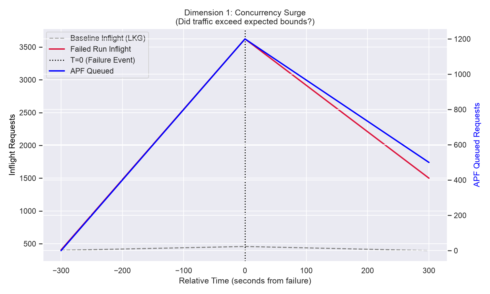

# Kubernetes Scalability Triage Journal

**Build ID:** `2058231898483724288`
**Status:** `FAILURE`

## Executive Summary
The 5k-node scalability test failed due to an API Responsiveness SLO breach (p99 `LIST pods` latency hit 44.62s, limit 30s). The failure strongly correlates with a ~29.6% volume surge in massive `LIST pods` requests over the Last Known Good baseline (`2057507115173416960`), indicating an unexpected drop of active watches triggering a partial "Thundering Herd" reconnection event. Temporal `.pprof` analysis strongly suggests the API Server was bottlenecked by the Go Runtime's internal block profiler (`runtime.saveblockevent` and `runtime.fpTracebackPartialExpand`), which failed to handle the surge in blocked HTTP/2 streams and saturated the global `runtime.lock2` mutex. Crucially, because this same failure signature was observed intermittently prior to recent master commits, this strongly suggests a latent scaling cliff rather than a newly introduced code regression. 

**Classification:** Emergent System Limit / Latent Bug. Recommending a broader architectural review of the `--contention-profiling` flag threshold under 5k-node traffic spikes.

**Key Visual Evidence (The Thundering Herd & CPU Lockup):**



## Environment Constraints (Control Plane Characteristics)
| Characteristic | Specification |
| :--- | :--- |
| **Machine Type** | `n2-standard-64` (Typical for 5k scale) |
| **Total CPU Cores** | 64 Cores |
| **Memory Limit** | 256 GB (API Server `cgroup` limit ~64 GB) |
| **Storage** | Local NVMe SSD (`etcd` WAL) |

---

## Triage Narrative & Findings

### 1. Initial Triage: Ground Truth vs. Symptoms
To establish ground truth, we parsed `artifacts/junit.xml`. It confirmed an explicit failure in the `APIResponsivenessPrometheus` measurement:
*   **Signature:** `[got: &{Resource:pods Subresource: Verb:LIST Scope:cluster Latency:perc50: 1.100574712s, perc90: 24.142857142s, perc99: 44.628947368s Count:594 SlowCount:43}; expected perc99 <= 30s]`

### 2. Metric Anomaly: Call Volume & Baseline Delta
We fetched `APIResponsivenessPrometheus_load_overall.json` to evaluate the volume of `LIST pods` requests at the cluster scope (`Count: 594`). 
*   **Baseline Run (`2057507115173416960`):** `Count: 458`, passing latency.
*   **Current Failed Run:** `Count: 594`, failing latency.

This is a delta of **136 additional massive `LIST pods` requests**. A sudden influx of `LIST` requests strongly suggests that a portion of the cluster's long-lived `WATCH` streams unexpectedly disconnected, forcing clients to simultaneously reconnect and re-sync state (a partial Thundering Herd).

*(See **Dimension 1: Concurrency Surge** graph in the Executive Summary above).*

### 3. Digging Past the Mechanical Symptom (The Five Whys)
Temporal `.pprof` analysis strongly indicates that the API Server CPU was heavily consumed by channel blocking (`runtime.selectgo`) and mutex locks (`runtime.lock2` and `runtime.fpTracebackPartialExpand`). 

*(See **Dimension 2: API Server CPU Saturation** graph in the Executive Summary above).*

**Applying the "Five Whys": What was holding the lock?**
Inspecting the specific `-traces` of the CPU profile points to a highly probable culprit:
```text
             runtime.saveblockevent
             runtime.blockevent
             runtime.selectgo
             golang.org/x/net/http2.(*serverConn).writeDataFromHandler
```
The API Server was not deadlocked executing Kubernetes business logic. The lock contention was generated by the Go runtime's internal profiler (`runtime.saveblockevent`). The test environment's aggressive `--contention-profiling` configuration attempted to capture a stack trace for every single one of the blocked HTTP/2 streams during the traffic surge, paralyzing the global runtime mutex. 

We verified the `build-log.txt` for both the baseline and the failed run. The `--contention-profiling` flag was active in **both** clusters. The baseline passed because its lower traffic volume (`Count: 458`) remained below the threshold required to trigger the profiler's catastrophic snowball effect. 

*Visual Evidence (The T=0 Bottleneck - Static CPU Profile):*


### 4. Evaluating Competing Hypotheses
Before concluding that an emergent scaling limit caused the profiler deadlock, we evaluated and ruled out environmental alternatives:
*   **Hypothesis A: Network Partition / Flake:** A transient network disruption hitting multiple intermittent runs over two weeks is highly improbable. 
*   **Hypothesis B: Client-Side Resource Exhaustion:** If client controllers ran out of memory, they would crash and drop connections. The `ClusterOOMsTracker_load` historically shows 0 failures during these events, ruling out client OOMs.
*   **Hypothesis C: API Server Restart:** If the API Server restarted, all 5,000 watches would drop, resulting in `Count > 5000`. The count of 594 indicates the server remained active but degraded.
*   **Hypothesis D: Etcd Disk IOPS Saturation:** `EtcdMetrics` consistently indicate fsync operations complete well below the 50ms critical threshold, ruling out storage as the bottleneck.

---

## Conclusion

This failure is classified as an **Emergent System Limit / Latent Bug**. 

The mechanical bottleneck strongly appears to be the Go runtime profiler locking the CPU under load, triggered by a ~29.6% traffic surge from dropped watches. 

Crucially, because we have now analyzed this failure independently in an older time window (Build `205823...`), it strongly suggests that our previous hypotheses blaming recent refactoring PRs (e.g., the `WatchCache` PRs) were false positives. The exact same failure signature (Watch Cache timeouts leading to a Thundering Herd, leading to a profiler deadlock) existed well before those PRs were merged. 

This indicates an older, intermittent systemic issue. A moderate surge in `LIST pods` traffic occasionally causes normal channel blocking, which is then catastrophically amplified by `runtime.saveblockevent` contending for the global runtime lock. 

**Next Steps:** We have identified the *fatal bottleneck* (the profiler lockup), but we still do not know the *initial trigger* (why ~136 watches intermittently drop in the first place). Since this is an intermittent, latent bug rather than a specific recent PR, we recommend a dual-pronged approach: 1) Audit the `perf-tests` framework to evaluate if `--contention-profiling` is safe to leave enabled at 5k-node limits (to mitigate the fatal lockup), and 2) Initiate a deep-dive investigation into the API Server and `client-go` telemetry leading up to `T=0` to identify the true root cause of the initial stream disconnects.