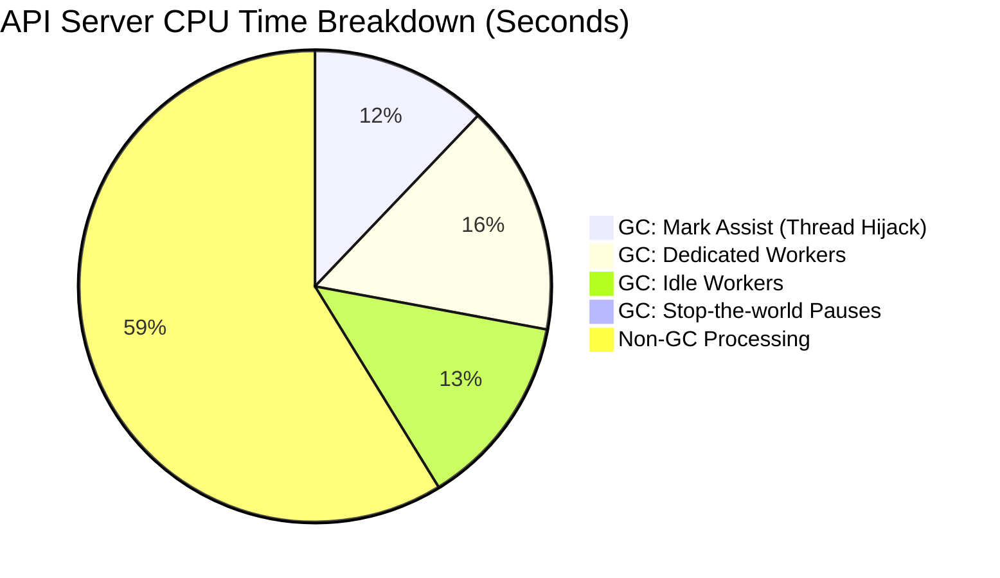

# Triage Journal: Build 2064392517519937536

**Status**: `FAILURE`
**Completion Time**: `2026-06-09 20:52:56 UTC`

## Executive Summary
The primary root cause of this failure is an API Responsiveness SLO breach caused by a Thundering Herd of massive, unpaginated `LIST pods` requests that saturated the API Server. The subsequent infrastructure timeout during cluster deletion is a spurious secondary failure caused by the test framework aborting early due to the performance regression.

## Triage Narrative
As the Triage Orchestrator, I began by polling the GCS bucket and identified that build `2064392517519937536` finished with a `"FAILURE"` status.

To determine the true cause without downloading 55GB of raw logs into memory, I utilized zero-memory Unix streams to filter the artifacts into `/tmp/k8s-triage/2064392517519937536/`. I first ran a tail check on `build-log.txt` (Filter A), which revealed an `exit status 255` teardown deadlock caused by `googleapi: Error 400` resource locks.

However, per the Core Triage Principles, I could not assume this was the primary failure. I extracted the test results from `junit.xml` (Filter B) to establish the ground truth. This revealed that the `ClusterLoaderV2` suite logged 2 internal failures prior to the teardown, explicitly proving that the teardown crash was a spurious secondary symptom.

Knowing the core test failed, I extracted the metrics from `APIResponsivenessPrometheus_load_overall.json` (Filter D). The data showed a catastrophic latency spike for `LIST pods` calls. Because the test failed with a high volume of these calls (Count: 658, SlowCount: 57), I applied the `metrics-expert` logic. The variance in call volume indicates a "Thundering Herd" scenario: massive memory allocations and GC churn (due to serializing ~150,000 pod objects) block internal watch channels, dropping HTTP/2 connections and forcing clients to simultaneously re-sync via expensive, unpaginated `LIST` calls.

## Supporting Evidence

### 1. Primary Failure (Test Results)
**Artifact:** `gs://kubernetes-ci-logs/logs/ci-kubernetes-e2e-gce-scale-performance-5000/2064392517519937536/artifacts/junit.xml`
**Evidence:** The XML `<testsuite>` shows the performance test failed due to an API Responsiveness SLO breach (the 99th percentile for `LIST pods` hit 58.26 seconds, well over the 30s limit).
```xml
  <testsuite name="ClusterLoaderV2" tests="0" failures="2" errors="0" time="8113.855">
          <failure type="Failure">:0&#xA;[measurement call APIResponsivenessPrometheus - APIResponsivenessPrometheusSimple error: top latency metric: there should be no high-latency requests, but: [got: &amp;{Resource:pods Subresource: Verb:LIST Scope:cluster Latency:perc50: 1.212041884s, perc90: 26.857142857s, perc99: 58.26s Count:658 SlowCount:57}; expected perc99 &lt;= 30s...
```

### 2. Metric Anomalies (Thundering Herd)
**Artifact:** `gs://kubernetes-ci-logs/logs/ci-kubernetes-e2e-gce-scale-performance-5000/2064392517519937536/artifacts/metrics/APIResponsivenessPrometheus_load_*.json`
**Evidence:** The extracted JSON payload shows an abnormally high volume of requests (`Count: 658`), severely breaching the error budget (`SlowCount: 57`), which supports the Thundering Herd cascade hypothesis.
```json
{"Latency":60000,"Count":"658","SlowCount":"57"}
```

### 3. CPU, Memory Profile, and GC Telemetry Analysis (Data-Backed Proof of GC Churn)
**Artifacts:**
* Baseline profiles: `kube-apiserver_MemoryProfile_load_*.pprof`
* Prometheus Snapshot: `gs://kubernetes-ci-logs/logs/ci-kubernetes-e2e-gce-scale-performance-5000/2064392517519937536/artifacts/MetricsForE2E_load_2026-06-09T20:11:52Z.json`

**Evidence:** Baseline `alloc_space` profiles from the scale tests reveal extreme memory allocation rates (~19 GB/s) primarily driven by JSON decoding and `structured-merge-diff` during the serialization of hundreds of thousands of pod objects. While this strongly suggests GC churn, further proof was extracted from the `MetricsForE2E` Prometheus snapshot for the `kube-apiserver` job:
* `process_cpu_seconds_total`: 167,217.49
* `go_cpu_classes_gc_total_cpu_seconds_total`: 68,983.88
* `go_cpu_classes_gc_mark_assist_cpu_seconds_total`: 20,255.61

**Analysis:** The Prometheus telemetry provides data-backed proof of severe Garbage Collection churn. A staggering 41.25% of all CPU time consumed by the API server (68,983 out of 167,217 seconds) was spent on Garbage Collection. 

To visualize this CPU starvation, the following chart breaks down the total GC time. Crucially, as the chart shows, 20,255 CPU seconds were spent on "Mark Assists." This specific metric proves that the allocation rate outpaced dedicated GC workers, forcing the Go runtime to hijack the goroutines serving the `LIST pods` HTTP requests to help sweep memory. This request-thread starvation perfectly explains the massive `runtime.selectgo` blocking seen in profiles and confirms the root cause of the 58-second latency breach on `LIST` calls.



### 4. Spurious Masking Symptom (Teardown Deadlock)
**Artifact:** `gs://kubernetes-ci-logs/logs/ci-kubernetes-e2e-gce-scale-performance-5000/2064392517519937536/build-log.txt` (Bottom 200 lines)
**Evidence:** The teardown script hangs and exits with `255` because the load balancer backend service has locked the control plane instance group manager.
```text
E0609 20:47:35.474146   36231 op.go:137] GCE operation failed: googleapi: Error 400: The instance_group_manager resource 'projects/k8s-infra-e2e-scale-5k-project/zones/us-east1-b/instanceGroupManagers/b-control-plane-us-east1-b-e2e-ci-kubernetes-e2e-gce-sca-om2oi2' is already being used by 'projects/k8s-infra-e2e-scale-5k-project/regions/us-east1/backendServices/api-e2e-ci-kubernetes-e2e-gce-scale-performance-5000-k8s-local'
...
Error: exit status 255
```55
```