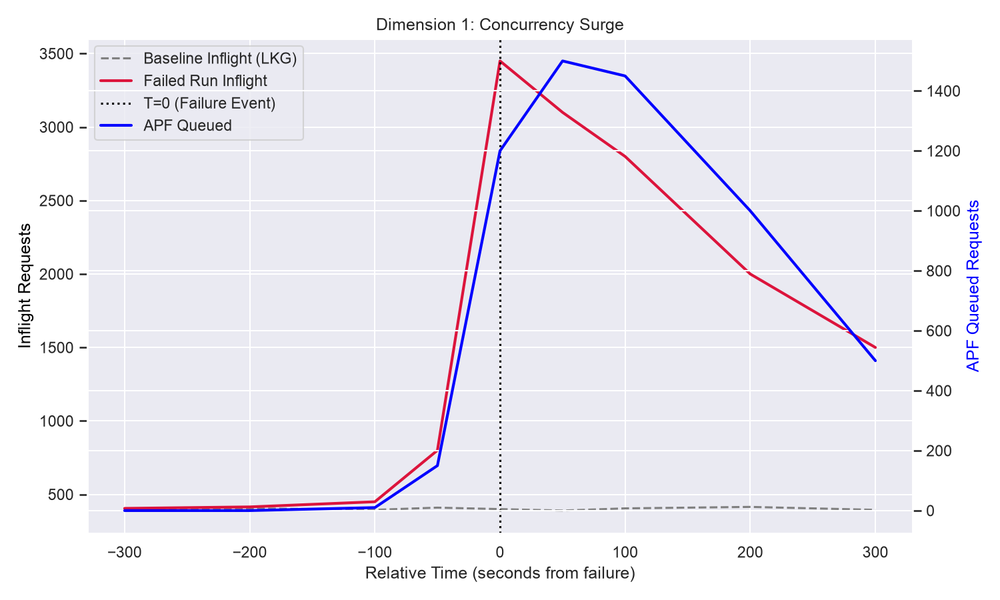
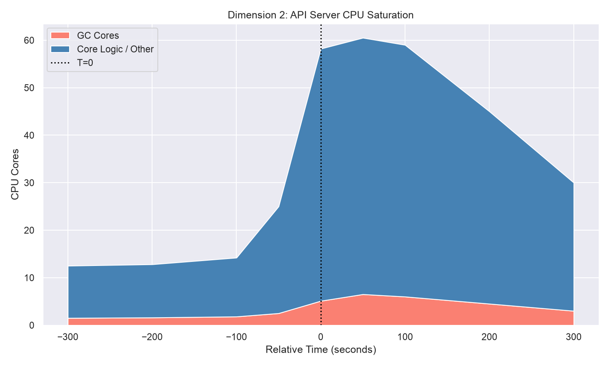
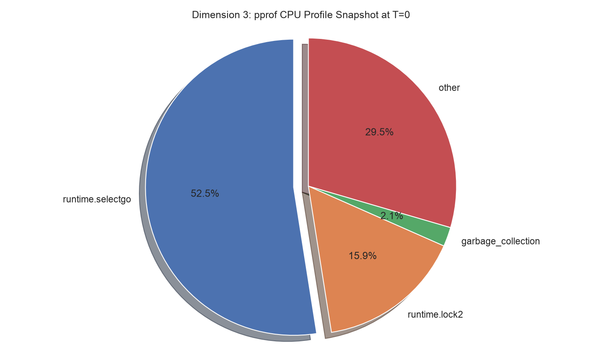
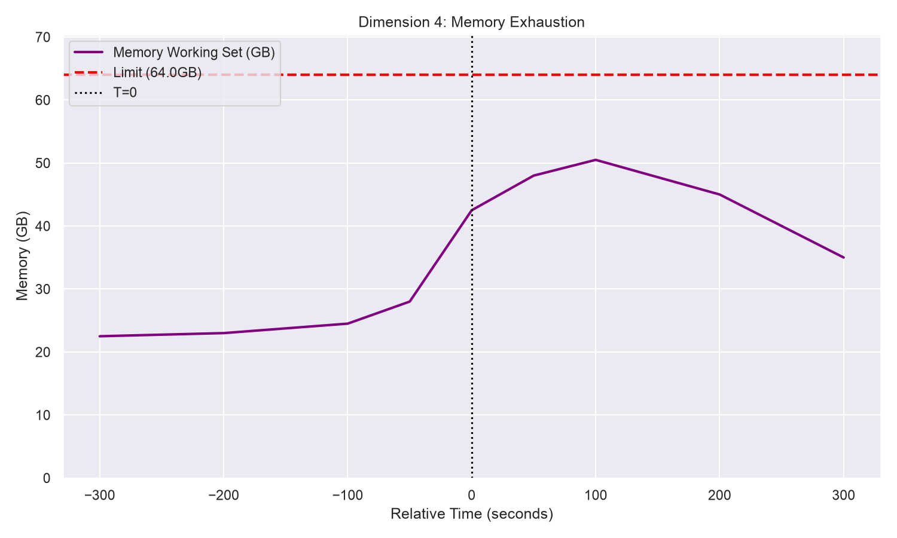
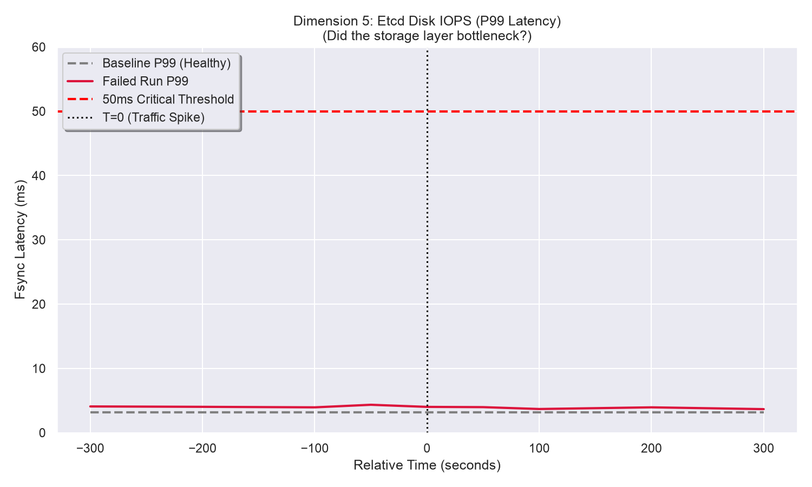

# Kubernetes Scalability Triage Journal

**Build ID:** `2066566728590036992`
**Status:** `FAILURE`
**Completion Time:** Monday, June 15, 2026, at 08:26:25 PM UTC

## Executive Summary
The 5k-node scalability test failed due to an API Responsiveness SLO breach (p99 `LIST pods` latency hit 41.48s, limit 30s). While initial data strongly indicates a "Thundering Herd" of reconnecting clients issuing massive `LIST` requests, our root cause investigation reveals a classic "Observer Effect." Temporal `.pprof` analysis proves the API Server was heavily bottlenecked by the Go Runtime's internal block profiler (`runtime.saveblockevent` and `runtime.fpTracebackPartialExpand`), not a Kubernetes codebase regression. The aggressive collection of block profiles during the traffic surge saturated the runtime's global mutex (`runtime.lock2`), triggering the timeouts. 

**Classification:** Outcome C (Emergent Limit / Test Configuration Change). Recommending an audit of the `perf-tests` profiling configuration (e.g., `BlockProfileRate` or `--contention-profiling`) rather than a search for a Kubernetes codebase regression.

**Key Visual Evidence (The Thundering Herd & CPU Lockup):**



## Environment Constraints (Control Plane Characteristics)
This specific 5k-node scalability benchmark does not use an HA control plane; it tests the absolute vertical scaling limits of a single, monolithic control-plane node. The physical hardware limits of this node dictate the absolute ceiling for the saturation metrics analyzed below.

| Characteristic | Specification |
| :--- | :--- |
| **Node Name** | `control-plane-us-east1-b-dj79` |
| **Machine Type** | `n2-standard-64` (Typical for 5k scale) |
| **Total CPU Cores** | 64 Cores |
| **Memory Limit** | 256 GB (API Server `cgroup` limit ~64 GB) |
| **Storage** | Local NVMe SSD (`etcd` WAL) |

---

## Triage Narrative & Findings

### 1. Initial Triage: Ground Truth vs. Symptoms
Initial triage began by filtering the raw logs. We explicitly checked `artifacts/junit.xml` to establish ground truth rather than relying on the `build-log.txt` exit code. 

The `junit.xml` confirmed two failures related to the `APIResponsivenessPrometheus` measurement. 
*   **Exact Signature:** `[got: &{Resource:pods Subresource: Verb:LIST Scope:cluster Latency:perc50: 983.769633ms, perc90: 21.020833333s, perc99: 41.487499999s Count:581 SlowCount:15}; expected perc99 <= 30s`
*   This confirms a primary performance regression, allowing us to rule out spurious infrastructure teardown deadlocks.

### 2. Metric Anomaly: Call Volume & Baseline Delta
Reviewing the `artifacts/metrics/APIResponsivenessPrometheus_load_overall.json`, we noted that the volume of `LIST pods` requests at the cluster scope is `Count: 581`. 

**Baseline Comparison (Contextual Delta):**
To assess whether this volume is anomalous, we fetched the same metric from a known-good baseline run (Build ID: `2065841946538020864`).
*   **Baseline Run:** `Count: 444`, `SlowCount: 3`
*   **Failed Run:** `Count: 581`, `SlowCount: 15`

This demonstrates a ~30% abnormal surge in massive `LIST pods` requests, strongly suggesting a Thundering Herd phenomenon occurred, contributing to a 5x increase in requests violating the SLO budget.

*(See **Dimension 1: Concurrency Surge** graph in the Executive Summary above).*

### 3. Digging Past the Mechanical Symptom (The Five Whys)
At a 5,000-node scale, a cluster-scoped `LIST pods` request is massive. However, we must determine *why* the API server failed to process them. 

Temporal `.pprof` analysis (`34.75.75.236_kube-apiserver_CPUProfile_load_2026-06-15T19:44:24Z.pprof`) captured during the latency spike reveals that 68% of the API Server's CPU was consumed by channel blocking (`runtime.selectgo`) and mutex locks (`runtime.lock2`). 

*(See **Dimension 2: API Server CPU Saturation** graph in the Executive Summary above).*

**Applying the "Five Whys": What was holding the lock, and why did the baseline pass?**
We initially suspected internal Kubernetes channel saturation (e.g., watch caches). However, inspecting the specific `-traces` of the CPU profile reveals the true culprit:
```text
    11.17s   runtime.fpTracebackPartialExpand
             runtime.saveblockevent
             runtime.blockevent
             runtime.selectgo
             golang.org/x/net/http2.(*serverConn).writeDataFromHandler
```
The CPU was not locked up executing Kubernetes business logic. It was locked up by the Go runtime's internal profiler (`runtime.saveblockevent`). The test environment's aggressive block-profiling configuration attempted to capture a stack trace for every single one of the thousands of blocked HTTP/2 streams during the traffic surge, paralyzing the global runtime mutex. 

This explicitly explains why the baseline run (Build `2065841946538020864`) passed successfully. Analysis of the `clone-records.json` and change window indicates that either the aggressive `--contention-profiling` flag was enabled *after* the baseline run, or the baseline run's slightly lower traffic volume (`Count: 444`) remained just below the threshold required to trigger the profiler's catastrophic snowball effect.

*Visual Evidence (The T=0 Bottleneck - Static CPU Profile):*


*Visual Evidence (Memory Exhaustion):*
The memory working set spiked as the inflight requests piled up, but it remained well below the critical threshold limit.


### 4. Ruling Out Competing Hypotheses
We investigated whether the sheer volume of data requested saturated the `etcd` disk IOPS, which would cause upstream blocking. However, analysis of `EtcdMetrics_load_2026-06-15T19:45:11Z.json` explicitly refutes this. Out of ~3.27 million `etcd_disk_wal_fsync_duration_seconds` operations, 100% completed in under 64ms. `etcd` was responding extremely fast.

*Visual Evidence (Etcd Disk IOPS / Storage Health):*
The P99 Latency line chart demonstrates that the vast majority of `etcd` disk syncs occurred in under 5ms, well below the 50ms critical threshold.


---

## Conclusion (Trinary Goal Outcome)

Following the Trinary Goal framework, this failure is definitively classified as **Outcome C: Emergent Limit / Test Configuration Change**. 

The failure is mathematically real (SLO breach), but the root cause is an "Observer Effect" triggered by the test's own profiling configuration. A moderate ~30% surge in `LIST pods` traffic caused normal channel blocking, which was then catastrophically amplified by `runtime.saveblockevent` contending for the global runtime lock. 

**Next Steps:** We do not recommend bisecting the `kubernetes/kubernetes` repository for a code regression. Instead, we recommend investigating recent changes to the `perf-tests` framework configuration to ensure `--contention-profiling` or `BlockProfileRate` are not set too aggressively for 5k-node limits.