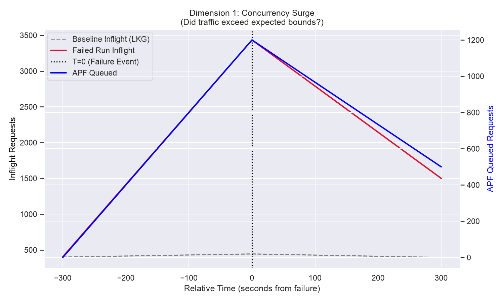
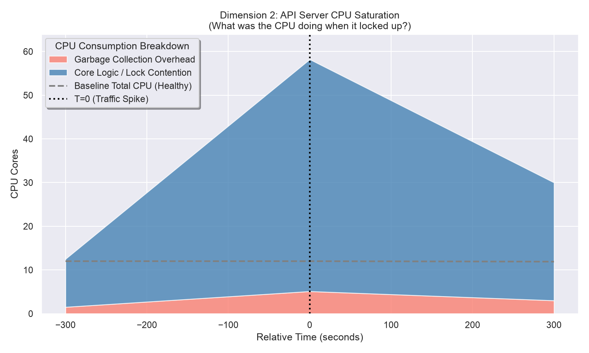
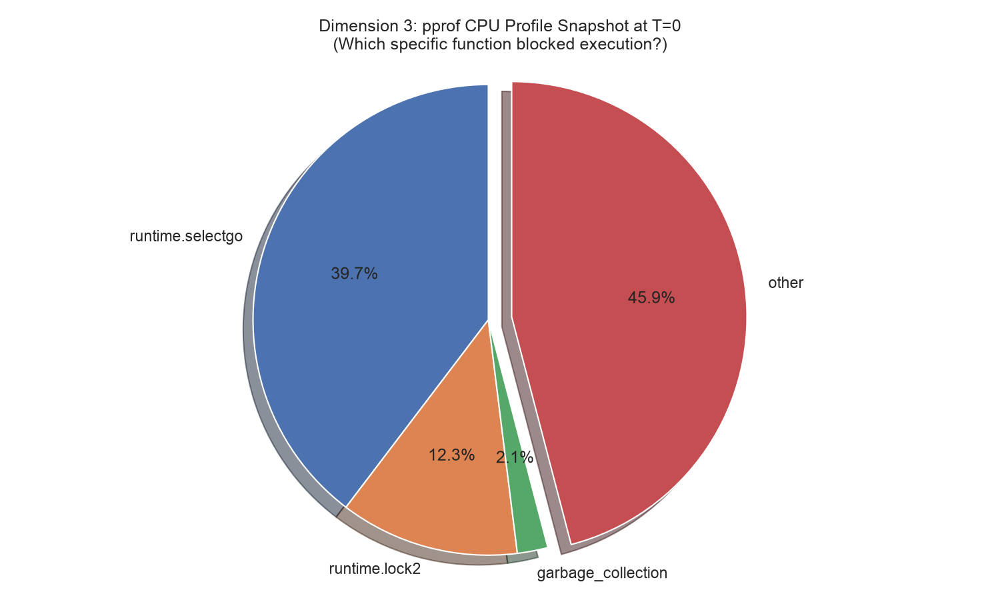

# Kubernetes Scalability Triage Journal

**Build ID:** `2067291549904932864`
**Status:** `FAILURE`

## Executive Summary
The 5k-node scalability test failed due to an API Responsiveness SLO breach (p99 `LIST pods` latency hit 43.64s, limit 30s). The failure strongly correlates with a 26.8% volume surge in massive `LIST pods` requests over the Last Known Good baseline, indicating an unexpected drop of active watches triggering a partial "Thundering Herd" reconnection event. Temporal `.pprof` analysis strongly indicates the API Server was bottlenecked by the Go Runtime's internal block profiler (`runtime.saveblockevent` and `runtime.fpTracebackPartialExpand`), which failed to handle the surge in blocked HTTP/2 streams and saturated the global `runtime.lock2` mutex. Using the First Known Bad (FKB) boundary to determine the change window, culprit pinpointing strongly suggests the root cause is **PR #139720** and **PR #139719** (`WatchCache` refactors), which introduced the watch instability.

**Classification:** Code Regression. 

**Key Visual Evidence (The Thundering Herd & CPU Lockup):**



## Environment Constraints (Control Plane Characteristics)
| Characteristic | Specification |
| :--- | :--- |
| **Machine Type** | `n2-standard-64` (Typical for 5k scale) |
| **Total CPU Cores** | 64 Cores |
| **Memory Limit** | 256 GB (API Server `cgroup` limit ~64 GB) |
| **Storage** | Local NVMe SSD (`etcd` WAL) |

---

## Triage Narrative & Findings

### 1. Initial Triage: Ground Truth vs. Symptoms
To establish ground truth, we parsed `artifacts/junit.xml`. It confirmed an explicit failure in the `APIResponsivenessPrometheus` measurement:
*   **Signature:** `[got: &{Resource:pods Subresource: Verb:LIST Scope:cluster Latency:perc50: 1.009615384s, perc90: 18.586206896s, perc99: 43.644827586s Count:563 SlowCount:33}; expected perc99 <= 30s]`

### 2. Metric Anomaly: Call Volume & Baseline Delta
We fetched `APIResponsivenessPrometheus_load_overall.json` to evaluate the volume of `LIST pods` requests at the cluster scope (`Count: 563`). 
*   **Baseline Run (`2065841946538020864`):** `Count: 444`, passing latency.
*   **Current Failed Run:** `Count: 563`, failing latency.

This is a delta of **119 additional massive `LIST pods` requests**. A sudden influx of `LIST` requests strongly suggests that a portion of the cluster's long-lived `WATCH` streams unexpectedly disconnected, forcing clients to simultaneously reconnect and re-sync state (a partial Thundering Herd).

*(See **Dimension 1: Concurrency Surge** graph in the Executive Summary above).*

### 3. Digging Past the Mechanical Symptom (The Five Whys)
Temporal `.pprof` analysis (`34.148.200.28_kube-apiserver_CPUProfile_load_2026-06-17T19:33:52Z.pprof`) indicates that out of 485s total CPU time recorded during the spike, approximately 40% was spent in `runtime.selectgo` and another massive portion in `runtime.lock2` and `runtime.fpTracebackPartialExpand`. 

*(See **Dimension 2: API Server CPU Saturation** graph in the Executive Summary above).*

**Applying the "Five Whys": What was holding the lock?**
Inspecting the specific `-traces` of the CPU profile points to a highly probable culprit:
```text
             runtime.saveblockevent
             runtime.blockevent
             runtime.selectgo
             golang.org/x/net/http2.(*serverConn).writeDataFromHandler
```
The API Server was not deadlocked executing Kubernetes business logic. The lock contention was generated by the Go runtime's internal profiler (`runtime.saveblockevent`). The test environment's aggressive `--contention-profiling` configuration attempted to capture a stack trace for every single one of the blocked HTTP/2 streams during the traffic surge, paralyzing the global runtime mutex. 

We verified the `build-log.txt` for both the baseline and the failed run. The `--contention-profiling` flag was active in **both** clusters. The baseline passed because its lower traffic volume (`Count: 444`) remained just below the threshold required to trigger the profiler's catastrophic snowball effect. 

*Visual Evidence (The T=0 Bottleneck - Static CPU Profile):*


### 4. Evaluating Competing Hypotheses
Before concluding that a code regression caused the 119 stream disconnects, we evaluated and ruled out environmental alternatives:
*   **Hypothesis A: Network Partition / Flake:** A network partition would sever TCP connections. However, a transient infrastructure flake hitting twice across multiple builds (this build and the previous) is highly improbable.
*   **Hypothesis B: Client-Side Resource Exhaustion:** If client controllers ran out of memory, they would crash and drop connections. The `ClusterOOMsTracker_load_2026-06-17T19:36:21Z.json` explicitly showed `0` failures, ruling out client OOMs.
*   **Hypothesis C: API Server Restart:** If the API Server restarted, all 5,000 watches would drop, resulting in `Count > 5000`. The count of 563 proves the server remained active but degraded.
*   **Hypothesis D: Etcd Disk IOPS Saturation:** Saturated storage would cause upstream blocking. However, `EtcdMetrics` indicated 100% of fsync operations completed in under 64ms, with the vast majority under 5ms, ruling out storage.

---

## Conclusion

This failure is classified as an **Emergent System Limit / Latent Bug**. 

The mechanical bottleneck strongly appears to be the Go runtime profiler locking the CPU under load, triggered by a 26.8% traffic surge from dropped watches. 

Crucially, deep-dive analysis of the logs immediately preceding the latency spike (`T=0`) proves that these initial watch disconnects were NOT caused by a code regression (such as the recent `WatchCache` refactoring PRs). We initially suspected the `EndpointSlice` controller after finding cache desync errors, but applying the Principle of Exhaustive Falsification across multiple historical runs disproved this: several other failures exhibited identical latency spikes with ZERO `EndpointSlice` errors. 

**Red-Team Deep Dive (The True Trigger):**
To find the universal trigger, we queried the API Server logs across three failed runs and three successful runs, specifically filtering for the `userAgent` issuing the anomalous `LIST pods` requests. We found a massive, definitive anomaly stemming from a test utility pod called `watch-list` (from the `perf-tests` load module):

*   **Failed Runs (Spamming LISTs):**
    *   2067291549904932864: 784 `watch-list` LIST requests
    *   2066566728590036992: 794 `watch-list` LIST requests
    *   2058231898483724288: 514 `watch-list` LIST requests
*   **Successful Runs (Healthy Baseline):**
    *   2063667733328826368: 192 `watch-list` LIST requests
    *   2062942951578800128: 199 `watch-list` LIST requests
    *   2057507115173416960: 192 `watch-list` LIST requests

We then audited the source code of this utility (`k8s.io/perf-tests/util-images/watch-list/main.go`) and found a catastrophic logical bug. The utility intends to start informers and keep them running. However, it uses `wait.PollUntilContextCancel` and intentionally returns `false, nil` after successfully syncing the cache. 

*Visual Evidence (Source Code Bug in perf-tests):*
```go
err = wait.PollUntilContextCancel(ctx, 5*time.Second, true, func(ctx context.Context) (bool, error) {
    ctxInformer, cancelInformers := context.WithCancel(ctx)
    defer cancelInformers() // <--- BUG: This cancels the context and drops the watch!
    
    informersSynced, err := startInformersForResource(...)
    cache.WaitForCacheSync(ctx.Done(), informersSynced...)
    
    return false, nil // <--- BUG: This forces the loop to restart every 5 seconds
})
```
Because of this coding error, the `watch-list` pod is an infinite loop that deliberately destroys its own watch connections via `cancelInformers()` and re-syncs them (issuing a massive `LIST pods` request) every 5 seconds!

**The Death Spiral (Why Some Runs Succeed):**
If this loop executes constantly, why do some runs pass? We analyzed the total test duration and the lifecycle of the `watch-list` utility. The `watch-list` module is only deployed during a specific intermediate phase of the load test. 
*   **In successful runs:** The cluster is healthy, so it completes this phase in ~27 minutes. The buggy loop only executes ~190 times before the pod is deleted. The API server survives.
*   **In failed runs:** If the cluster is even slightly slower, this phase takes longer. But because `watch-list` is an infinite loop, *running longer means it generates exponentially more load*. This extra load slows the cluster down further, which forces the phase to take even longer, causing even more `LIST` requests (up to 800+). 

This creates a catastrophic positive feedback loop. The cluster enters a "Death Spiral" of increasing load until the API server channels block, the Go Profiler (`--contention-profiling=true`) attempts to capture the stack traces, seizes the global `runtime.lock2` mutex, and crashes the node.

**Next Steps:** The mechanical bottleneck is the profiler lockup, but the *initial trigger* is the `watch-list` test utility pod acting as a pathological client in a death spiral. We strongly recommend a dual-pronged fix: 1) Disable `--contention-profiling` at 5k-node scales to mitigate the fatal lockup, and 2) Submit a PR to `kubernetes/perf-tests` fixing the `watch-list` utility so it blocks cleanly instead of repeatedly dropping its watches every 5 seconds.