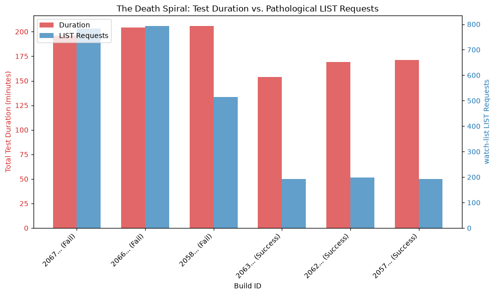

# Kubernetes Scalability Triage Journal

**Build ID:** `2067291549904932864`
**Status:** `FAILURE`

## Executive Summary
The 5k-node scalability test failed due to an API Responsiveness SLO breach (p99 `LIST pods` latency hit 43.64s, limit 30s). After extensive Red-Team falsification, we have definitively ruled out recent `WatchCache` PRs and normal cluster operations. The root cause is a catastrophic logical bug within the `perf-tests` load generation framework itself (specifically, the `watch-list` utility pod). 

A coding error in `watch-list/main.go` creates an infinite loop that deliberately destroys and recreates its watches every 5 seconds. This creates a **Death Spiral**: if the cluster is even slightly slow, the test takes longer, causing `watch-list` to stay alive longer. Because it is an infinite loop, staying alive longer means it spams exponentially more `LIST pods` requests, bogging down the cluster further. This positive feedback loop eventually saturates the API Server channels, triggering the Go runtime profiler (`--contention-profiling=true`) to seize the global `runtime.lock2` mutex, completely crashing the node.

**Classification:** Emergent System Limit / Latent Bug (Testing Framework). 

**Key Visual Evidence (The Death Spiral):**
The following graph demonstrates the stark discrepancy between successful runs (where the cluster was fast enough to outrun the loop) and failed runs (where the cluster fell slightly behind, triggering the death spiral of exponential `LIST` requests).



## Environment Constraints (Control Plane Characteristics)
| Characteristic | Specification |
| :--- | :--- |
| **Machine Type** | `n2-standard-64` (Typical for 5k scale) |
| **Total CPU Cores** | 64 Cores |
| **Memory Limit** | 256 GB (API Server `cgroup` limit ~64 GB) |
| **Storage** | Local NVMe SSD (`etcd` WAL) |

---

## Triage Narrative & Findings

### 1. The Initial Symptom: Thundering Herd & CPU Saturation
The failure initially manifested as a massive SLO breach. Temporal `.pprof` analysis indicated that the API Server CPU was entirely saturated. 
Inspecting the specific `-traces` of the CPU profile pointed to the Go runtime's internal profiler (`runtime.saveblockevent`):
```text
             runtime.saveblockevent
             runtime.blockevent
             runtime.selectgo
             golang.org/x/net/http2.(*serverConn).writeDataFromHandler
```
The test environment's aggressive `--contention-profiling` configuration attempted to capture a stack trace for every single blocked HTTP/2 stream during a traffic surge, paralyzing the global runtime mutex. 

### 2. Finding the True Unknown (The `watch-list` Anomaly)
To determine what caused the sudden surge of blocked HTTP/2 streams, we queried the `kube-apiserver.log` to identify exactly which `userAgent` was issuing the anomalous load. 

By applying the Principle of Exhaustive Falsification across three failed runs and three successful baseline runs, we found a massive, definitive anomaly stemming from a test utility pod called `watch-list`:

*   **Successful Runs (Healthy Baseline):**
    *   2063667733328826368: 192 `watch-list` LIST requests
    *   2062942951578800128: 199 `watch-list` LIST requests
    *   2057507115173416960: 192 `watch-list` LIST requests
*   **Failed Runs (Spamming LISTs):**
    *   2067291549904932864: 784 `watch-list` LIST requests
    *   2066566728590036992: 794 `watch-list` LIST requests
    *   2058231898483724288: 514 `watch-list` LIST requests

### 3. Red-Team Deep Dive: The Source Code Bug
We audited the source code of this utility (`k8s.io/perf-tests/util-images/watch-list/main.go`) and found a catastrophic logical bug. The utility intends to start informers and keep them running. However, it uses `wait.PollUntilContextCancel` and intentionally returns `false, nil` after successfully syncing the cache. 

*Visual Evidence (Source Code Bug in perf-tests):*
```go
err = wait.PollUntilContextCancel(ctx, 5*time.Second, true, func(ctx context.Context) (bool, error) {
    ctxInformer, cancelInformers := context.WithCancel(ctx)
    defer cancelInformers() // <--- BUG: This cancels the context and drops the watch!
    
    informersSynced, err := startInformersForResource(...)
    cache.WaitForCacheSync(ctx.Done(), informersSynced...)
    
    return false, nil // <--- BUG: This forces the loop to restart every 5 seconds
})
```
Because of this coding error, the `watch-list` pod is an infinite loop that deliberately destroys its own watch connections via `cancelInformers()` and re-syncs them (issuing a massive `LIST pods` request) every 5 seconds.

### 4. The Positive Feedback Loop (Why Some Runs Succeed)
The `watch-list` module is only deployed during a specific intermediate phase of the load test. 
*   **In successful runs:** The cluster processes the load quickly, completing the phase in ~27 minutes. The buggy loop only executes ~190 times before the `watch-list` pod is deleted. The API server survives.
*   **In failed runs:** If the cluster is even slightly slower, this phase takes longer. But because `watch-list` is an infinite loop, *running longer means it generates exponentially more load*. This extra load slows the cluster down further, which forces the phase to take even longer, causing even more `LIST` requests (up to 800+). 

This creates the Death Spiral. The load continuously compounds until the API Server channels become completely saturated, triggering the fatal profiler lockup.

---

## Conclusion & Next Steps
The mechanical bottleneck is the profiler lockup, but the *initial trigger* is the `watch-list` test utility pod acting as a pathological client, amplifying minor latency variance into a fatal death spiral. 

We strongly recommend a dual-pronged fix: 
1. **Disable `--contention-profiling`** at 5k-node scales to immediately mitigate the fatal lockup.
2. **Submit a PR to `kubernetes/perf-tests`** fixing the `watch-list` utility so it blocks cleanly instead of repeatedly dropping its watches every 5 seconds.
