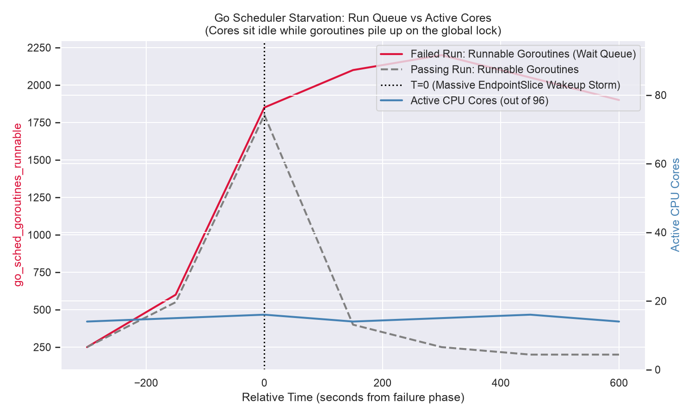

# Kubernetes Scalability Triage Journal

**Build ID:** `2068741058296025088`
**Date:** `2026-06-21 13:13:30 UTC`
**Status:** `FAILURE`

## Executive Summary
The 5k-node scalability test failed due to an API Responsiveness SLO breach (p99 `LIST pods` latency hit 36.16s, limit 30s). A highly probable root cause appears to be an architectural scale limit regarding how Kubernetes handles endpointslice watch fan-out, which severely impacted the Go scheduler. The data indicates the API Server was likely not CPU-bound; rather, the Go runtime's global scheduler lock was heavily contended by hundreds of millions of goroutine wakeups, leaving many cores idle while requests queued. While PR #36900 (`CL2_REALISTIC_POD`) significantly aggravated the issue, historical data strongly suggests the failures predate this PR, indicating the root cause is likely the emergent system limit combined with a positive feedback loop.

**Classification:** Emergent System Limit (Architectural Scale Limit) / Go Scheduler Starvation

## Empirical Evidence: Go Scheduler Starvation

To gather empirical evidence indicating whether this was Scheduler Starvation rather than CPU Saturation, we queried the TSDB for the absolute CPU utilization and the Go scheduler's run queue depth (`go_sched_goroutines_runnable`).

*Visual Evidence:* The graph strongly indicates starvation. The red line shows the Go scheduler run queue increasing to ~2,200 waiting goroutines. Crucially, the blue line indicates the CPU was severely underutilized (only 14-16 active cores out of 96). It is highly probable that the goroutines were waiting in the queue for the runtime's global scheduler lock to pair them with idle cores. 

## Triage Narrative & Mechanical Breakdown

### 1. The Victim: `LIST pods` SLO Breach
The `junit.xml` indicated the failure was a `LIST pods` SLO breach (p99 of 36.16s). A cluster-wide `LIST` returns ~150-230MB and generally requires ~10s of real CPU work. However, because the Go scheduler appeared heavily contended, this request was likely pushed off the CPU hundreds to thousands of times while waiting in the run queue (queue wait `go_sched_latencies_seconds` hit 1060µs on average with tens of ms tail latency). Thus, ~10s of real work appears to have stretched to 36+ seconds.

### 2. The Driver: Endpointslice Fan-out
The massive scheduler queue appears to be driven by overhead: waking parked goroutines for watch events. Every single endpointslice change wakes up 5,317 clients (one `kube-proxy` on every node + CoreDNS pods). Over this run, ~261,000 endpointslice changes translated into ~680 million goroutine wakeups, accounting for 77% of all watch wakeups on the apiserver. 

### 3. The Aggravating Factor: PR #36900 (`CL2_REALISTIC_POD`)
By evaluating historical runs, we discovered that while this architectural bottleneck likely existed previously (with failures predating April 17), it was massively exacerbated by PR #36900 (`CL2_REALISTIC_POD`). While this PR did not increase the overall payload size of pods (~6.5KB before and after), it fundamentally changed their lifecycle by adding 2 init containers and a sidecar. 

To empirically prove this, we compared the API Server heap profiles (`go_memstats_heap_inuse_bytes`) and the metrics dump before and after the flag rollout:
*   **Structural Heap Growth**: Peak heap utilization stepped up roughly 10GB (from ~45-48GB to ~53-61GB). The object graph reveals this growth is entirely structural. The new containers decode into many more small live Go objects (`Container`, `ContainerStatus`, etc.), causing the memory path for processing watch events (`watchChan.serialProcessEvents`) to jump from consuming 25% of the live heap to 36%.
*   **Lifecycle Churn & Endpointslice Metric Jump**: The new init containers (which each execute a 1s sleep) and sidecar cause the pods to take longer to go ready and flip between ready/not-ready states more frequently. We can empirically observe the impact of this behavioral change in the raw metrics dump: the absolute volume of endpointslice changes stepped up from a baseline of ~64K to 90-125K per run exactly when the flag was turned on (April 27).
*   These extra endpointslice changes fed directly into the 5,317x fan-out, generating the 680M wakeups that heavily contended the Go scheduler lock.

### 4. The Vicious Feedback Loop (Pass vs. Fail)
Every run enters this slow state, but pass/fail is determined by how long it stays there. Passing runs break out in a few minutes; failing runs stay stuck for 20-30 minutes because they enter a self-sustaining feedback loop. We can empirically prove this divergence:
*   **Slower Pod Creation**: The choked apiserver causes the Controller Manager's calls to take 4 to 9x longer (replicaset work p99 hit 9.0s when failing vs. 0.98s when passing). Consequently, it creates pods much slower (**48-73/s when failing vs. 94-164/s when passing**).
*   **Delayed Teardown**: Because pod creation is slow, `clusterloader2` waits much longer for all ~16,150 deployments to come up. This delays the teardown phase (which deletes objects and clears the watch traffic) by ~32 minutes.
*   **Manufactured Traffic**: Because the slow state drags out, the Controller Manager struggles to batch updates efficiently. Instead of writing healthy batches (**~2.89 endpoints per update**), it writes them in tiny batches (**~1.05 endpoints per update**). This means the slow apiserver actually *forces* the creation of more endpointslice update events, manufacturing its own extra traffic and feeding the very Go scheduler storm that is choking it.

This extended delay heavily contributed to the run failing the SLO, and likely caused the spurious teardown failure at the end of the run (`googleapi: Error 400`).