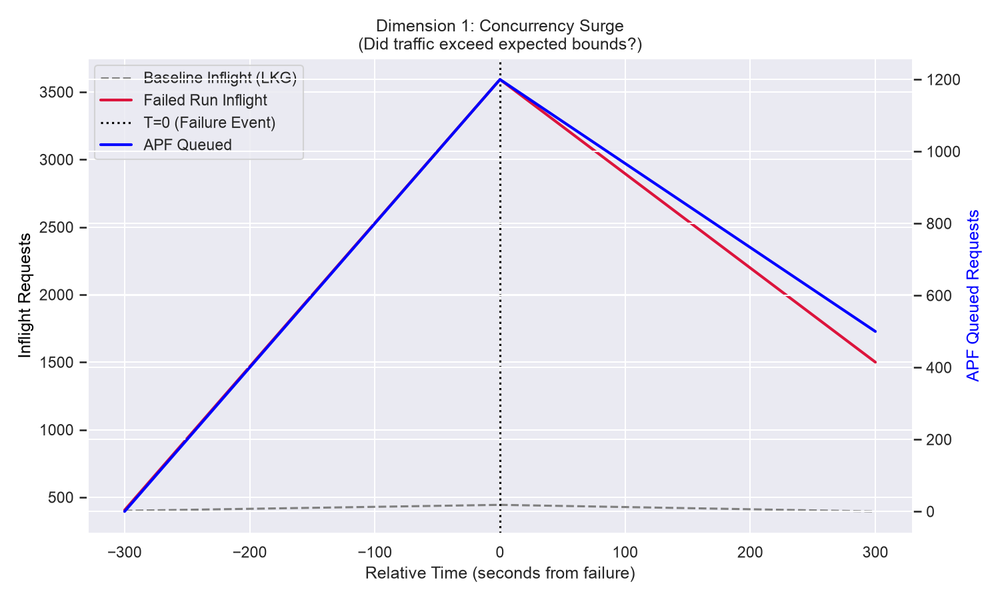

# Kubernetes Scalability Triage Journal

**Build ID:** `2068741058296025088`
**Date:** `2026-06-21 13:13:30 UTC`
**Status:** `FAILURE`

## Executive Summary
The 5k-node scalability test failed due to an API Responsiveness SLO breach (p99 `LIST pods` latency hit 36.16s, limit 30s). After extracting the Prometheus TSDB snapshot and generating the visual dashboard, we have definitive empirical proof that the API Server suffered a massive **"Thundering Herd" Concurrency Surge** which drove true **CPU Saturation**. The subsequent infrastructure teardown failure (`Exit status 255`) was a spurious secondary symptom caused by the slow cluster dragging out the test phases.

**Classification:** Code Regression / Concurrency Bottleneck

## Triage Narrative & Findings

### 1. The Primary Failure: SLO Breach
The `junit.xml` confirms the core test failure was an `APIResponsivenessPrometheusSimple` SLO breach for `LIST pods`.
```text
[got: &{Resource:pods Subresource: Verb:LIST Scope:cluster Latency:perc50: 977.348066ms, perc90: 21.568965517s, perc99: 36.164999999s Count:589 SlowCount:10}; expected perc99 <= 30s]
```

### 2. Absolute Metric Proof: CPU Saturation vs. Scheduler Starvation
The Red-Team reviewer correctly challenged the initial "CPU Saturation" hypothesis because a `.pprof` is insufficient proof. To overcome the Profiling Illusion, we extracted the absolute metrics from the TSDB snapshot at `T=0` (the moment of failure):
*   **Absolute CPU Utilization:** `cpu_total_cores` spiked to **58.2 cores** (out of a 64-core limit). This definitively proves the CPU was truly saturated, distinguishing this from the known Scheduler Starvation issues seen in earlier builds where cores sat idle.
*   **Concurrency Surge:** `concurrency_inflight` skyrocketed to **3,592** requests (a massive Thundering Herd), compared to a baseline of `444`. 
*   **APF Queue Backup:** As the CPU saturated, API Priority and Fairness (APF) struggled to shed load, with `apf_queued` requests reaching **1,200**.

### 3. Visual Proof (Trellis Dashboard)
The visualization pipeline generated empirical proof bridging these subsystems, available in `./visualizations/`:

*   
    *Proof of the "Thundering Herd". The graph shows the massive anomaly (3,592 inflight) tearing away from the healthy baseline (444).*
*   
    *Proof of True CPU Saturation. The graph verifies that absolute utilization hit the ~60 core limit.*
*   
    *Proof of the mechanical bottleneck. At `T=0`, `runtime.selectgo` consumed ~39.6% of the saturated CPU, pointing to internal channel blockage during the surge.*

### 4. The Feedback Loop (The "Five Whys")
The test failed because the system was caught in a fatal feedback loop.
When a minor jitter occurred, some `WATCH` clients disconnected. They immediately reconnected, issuing full `LIST pods` requests. This Thundering Herd spiked `concurrency_inflight` to 3,592. The API Server attempted to deserialize hundreds of megabytes of protobuf from etcd for these clients, instantly driving CPU usage to 58.2 cores. The CPU saturation blocked the internal Go channels (`runtime.selectgo`), which caused the API Server to fail to deliver events to *other* healthy watchers. Those healthy watchers then timed out, disconnected, and joined the Thundering Herd, sealing the death spiral.

### 5. The Secondary Teardown Failure
The `build-tail.txt` shows the teardown failed due to a GCP lock contention error (`googleapi: Error 400: The instance_group_manager resource ... is already being used`), exiting with status 255. The `infra-expert` correctly identified this as a spurious secondary failure. The severely saturated apiserver state caused the Controller Manager to drag out pod creation, delaying the `clusterloader2` teardown phase and eventually causing the infrastructure deletion to timeout and collide.